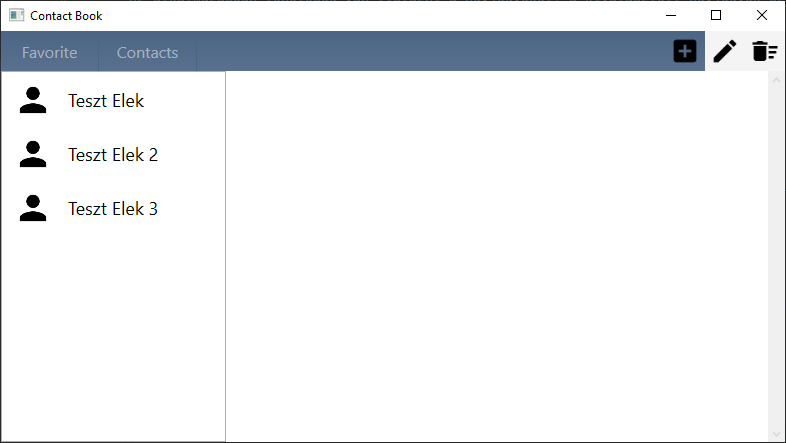
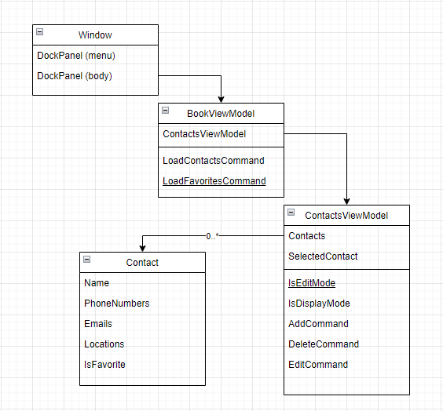

# ContactBook

## Bemutató

Az alakalmazás egy egyszerű telefonkönyv alkalmazás Grafkus (WPF) felülettel.
Az alkalmazásban lehetőség van listázni a névjegyeket, a kiválasztott névjegyek szerkeszteni és törölni illetve újat felvenni.
A névjegyeket megjelölhetjük kedvencnek és így könnyedén szűrhetjük a listát.

## Alkalmazásfelépítés

Az alkalmazás MVVM felépítéssel készült.

## Tesztelés

Az alkalmazás egy része (Helper) Unit tesztekkel le van fedve. A Model és ViewModel modulok getter és setter-ekből állnak, így azok tesztelése nem indokolt.

## Továbbfejlesztési lehetőségek

Sajnálatos módon az alkalmazás lényegi része az adatok mentése még nem készült el. Az adatok mentését akár lokálisan fájlba/adatbázisba, akár távoli adatbázishoz csatlakozva meg lehetne valósítani.
A felület támogatja egyedi képek beállítását, de sajnos ez a funkció sem készült még el. A képet base64 formátumban az alapadatokkal együtt lehetne tárolni.

### További fejlesztési lehetőségek

- Keresés név/telefonszám/emal alapján
- Névjegy(ek) export és import lehetősége
